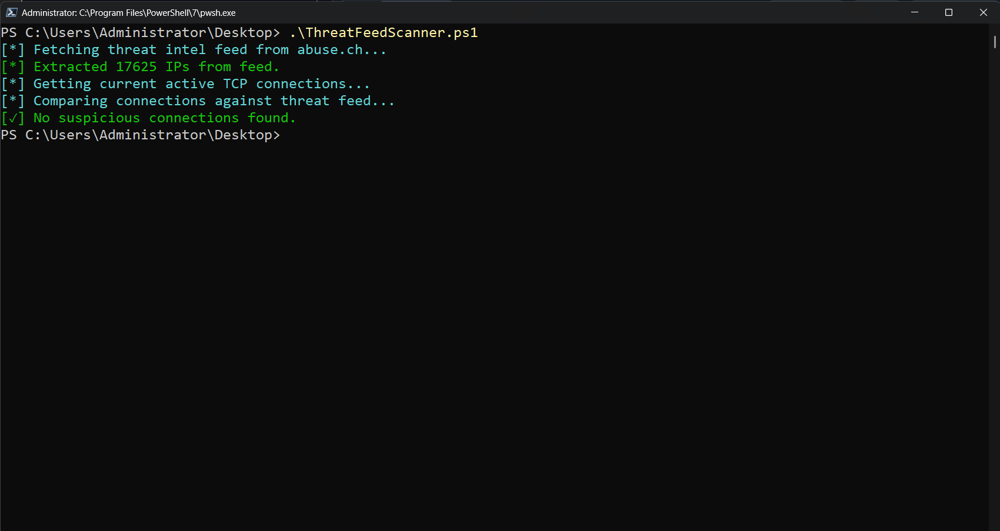
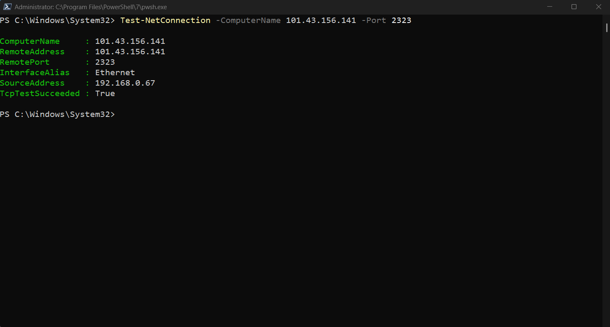
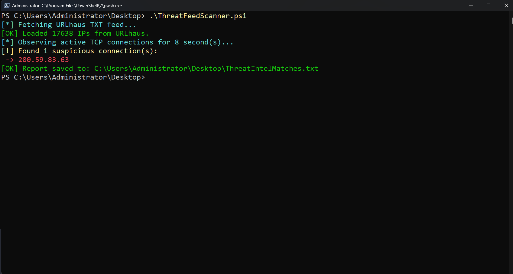
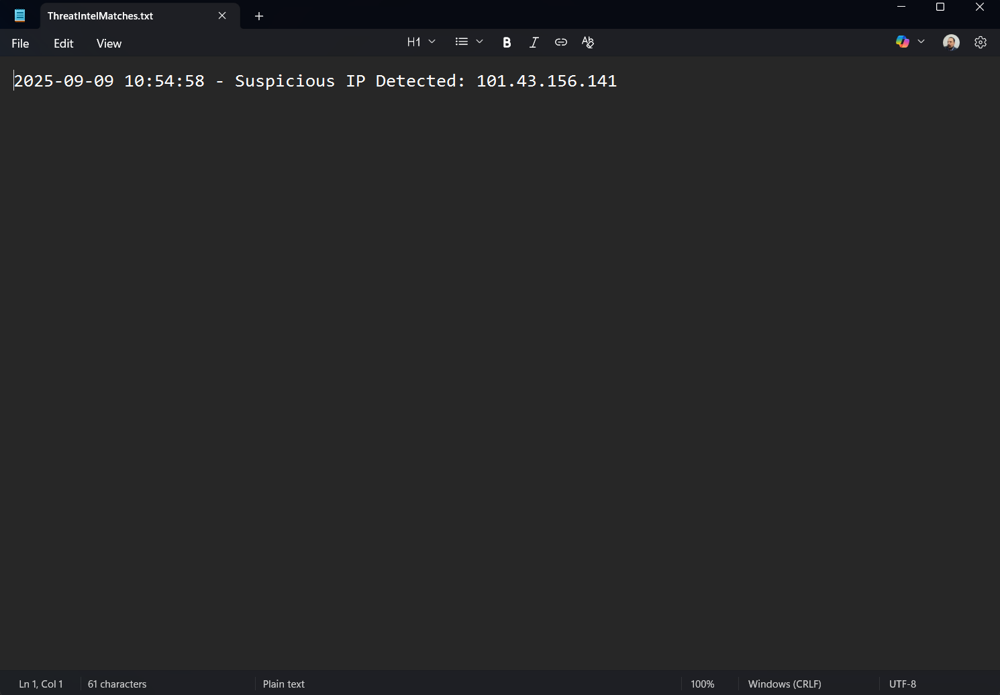

# 🛡️ PowerShell Threat Feed Scanner

A lightweight PowerShell script that scans your system’s **active TCP connections** and compares them to **real-time malicious IPs** from [URLhaus](https://urlhaus.abuse.ch/).

Built for blue teamers, SOC analysts, and cybersecurity students looking to practice threat hunting using native Windows tools.

---

## Features

- Fetches live threat intelligence IPs from abuse.ch (URLhaus)
- Lists active outbound TCP connections (`netstat`)
- Detects and flags matches with known malicious IPs
- Saves suspicious matches to a report file on the desktop
- 100% PowerShell, no external dependencies

---

## How to Test It

To simulate a match with a known malicious IP:

```powershell
Test-NetConnection 45.155.205.102 -Port 80
```

Then run the script again:

```powershell
.\ThreatFeedScanner.ps1
```

⚠️ **Do not download any content** from these IPs. The test is only meant to generate a detectable connection in `netstat` for demonstration purposes.

---

## Usage

```powershell
git clone https://github.com/Athanasios-Oikonomopoulos/PowerShell-Threat-Feed-Scanner.git
cd PowerShell-Threat-Feed-Scanner
.\ThreatFeedScanner.ps1
```

- The script will fetch the feed, scan your active connections, and log any hits.
- You’ll find the log file here:
  ```
  C:\Users\<YourName>\Desktop\ThreatIntelMatches.txt
  ```

---

## 📁 File Structure

```
PowerShell-Threat-Feed-Scanner/
├── ThreatFeedScanner.ps1         # Main script
├── README.md                     # This documentation
├── LICENSE                       # MIT License
└── screenshots/                  # Demo images for README
    ├── Clean_Example.png
    ├── Match_Example.png
    ├── Test_Connection.png
    └── Threat_Intel_Matches.png
```

---

## 📸 Screenshots

### ✅ Clean Result

> Example of no matches (no suspicious IPs detected).



---

### 🔄 Testing a Malicious Connection

> Using `Test-NetConnection` to simulate activity toward a known malicious IP.



---

### ❌ Malicious Connection Found

> A match was found against a known bad IP from the threat feed.



---

### 📝 Threat Intel Log File

> Suspicious IPs are written to a timestamped report on the Desktop.



---

## 📄 License

This project is licensed under the **MIT License**, open-source and free to use, modify, and share.

---

## ✨ Author

**Athanasios Oikonomopoulos**  
🔗 [LinkedIn](https://www.linkedin.com/in/athanasios-oikonomopoulos/)  
🔗 [TryHackMe](https://tryhackme.com/p/B4ckD00rR4t)  
🔗 [GitHub](https://github.com/Athanasios-Oikonomopoulos)

---

## 🤝 Contribute

Pull requests are welcome! If you want to improve the script, add additional feeds, or customize detection logic, feel free to open an issue or PR.

---

