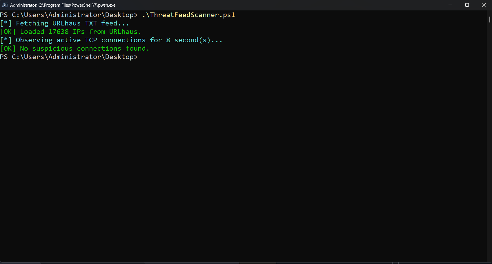

# 🛡️ PowerShell Threat Feed Scanner

A lightweight PowerShell script that scans your system’s **active TCP connections** and compares them to **real-time malicious IPs** from [URLhaus](https://urlhaus.abuse.ch/).

Built for blue teamers, SOC analysts, and cybersecurity students looking to practice threat hunting using native Windows tools.

---

## Features

- Fetches live threat intelligence IPs from abuse.ch (URLhaus)
- Lists active outbound TCP connections (`Get-NetTCPConnection`)
- Detects and flags matches with known malicious IPs
- Saves suspicious matches to a report file on the desktop
- **NEW:** Optional geolocation enrichment (ThreatFeedScanner-Geo.ps1) using ip-api.com

---

## How to Test It

First, **open a PowerShell terminal with administrator privileges**.

Then use it to simulate a match with a known malicious IP from the URLhaus feed by running the following **PowerShell one-liner**:

```powershell
$r = New-Object Net.Sockets.TcpClient; $r.Connect("200.59.83.63", 50623); Start-Sleep 10; $r.Close()
```

**This command will give you 10 seconds to simulate a connection** to a malicious IP and port of your choice (e.g. one you found in the URLhaus feed), long enough for the script to detect it in a scan. The connection is then **safely closed automatically**.

While the connection is still active, **open a second PowerShell terminal (also as administrator)** and run your script:

```powershell
.\ThreatFeedScanner.ps1
```

⚠️ **Do not download or interact with content** from these IPs. This test only opens a temporary TCP connection (using `TcpClient`) for detection by the script, no data is transmitted or received.

---

## Usage

```powershell
git clone https://github.com/Athanasios-Oikonomopoulos/PowerShell-Threat-Feed-Scanner.git
cd PowerShell-Threat-Feed-Scanner
.\ThreatFeedScanner.ps1
```

- The script will fetch the feed, scan your active connections, and log any hits.
- You’ll find the log file here:
  ```
  C:\Users\<YourName>\Desktop\ThreatIntelMatches.txt
  ```

---
## 🌍 New Version: ThreatFeedScanner-Geo.ps1 (with Geolocation Feature)

In addition to the original scanner, a new script `ThreatFeedScanner-Geo.ps1` is available.  
It works the same way as `ThreatFeedScanner.ps1` but adds **IP geolocation enrichment** using the free [ip-api.com](http://ip-api.com) service.

### How it works
- Detects active connections against the URLhaus feed (same as original).
- For each matched IP, queries ip-api.com and retrieves:
  - Country, Region, City
  - ISP and Organization
  - Latitude & Longitude
- Saves results to a timestamped log file on the Desktop, with geolocation metadata included.

⚠️ Note: ip-api.com free tier allows ~45 requests per minute. If your scan finds many matches, results may be rate-limited. Consider adding a short Start-Sleep between lookups or using a paid/HTTPS provider for higher limits.

---

## 📸 Screenshots (Original version without the geolocation feature)

### ✅ Clean Result

> Example of no matches (no suspicious IPs detected).



---

### 🔄 Testing a Malicious Connection

>Opening a raw TCP connection to a known bad IP for detection testing.


---

### ❌ Malicious Connection Found

> A match was found against a known bad IP from the threat feed.


---

### 📝 Threat Intel Log File

> Suspicious IPs are written to a timestamped report on the Desktop.


---

## 🌍 Geo-Enhanced Version Screenshots

> The following images show the `ThreatFeedScanner-Geo.ps1` output and log examples (geolocation enrichment via ip-api.com).

#### ✅ Clean Result (with Geolocation)  
>Example of no matches.


---

#### ❌ Malicious Connection Found (with Geolocation)  
>Shows malicious IP detection + enrichment with ISP, Country, and City.


---

#### 📝 Threat Intel Log File (Geo Version)  
>Suspicious IPs written to a report, including geolocation metadata.


---

## 📄 License

This project is licensed under the **MIT License**, open-source and free to use, modify, and share.

---

## ✨ Author

**Athanasios Oikonomopoulos**  
🔗 [LinkedIn](https://www.linkedin.com/in/athanasios-oikonomopoulos/)  
🔗 [TryHackMe](https://tryhackme.com/p/B4ckD00rR4t)  

---

## 🤝 Contribute

Pull requests are welcome! If you want to improve the script, add additional feeds, or customize detection logic, feel free to open an issue or PR.

---

